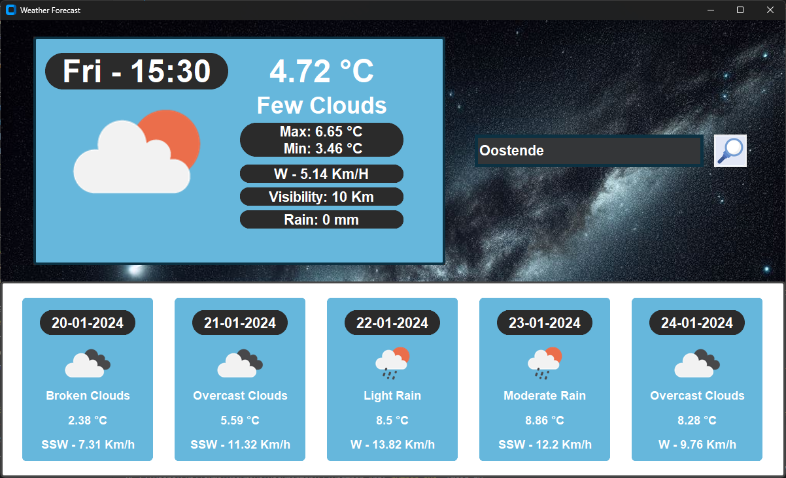

# Weather App

This is a simple weather application built using Python and the Tkinter library for the graphical user interface. The app fetches current weather data and a 5-day forecast at 12:00 UTC for a specified location using the OpenWeatherMap API.

You can make use from my API token to get weather data since it is from a free subscription and only served purpose to build this app. Can always change the API key and other parameters in the JSON file provided. 

## Preview



## Requirements

Ensure you have the required Python packages installed:

```
pip install customtkinter tkinter pillow metpy requests
```

## Usage

Run the Weather App by executing the following command:

```
python weather_app.py
```

The application window will open, allowing you to enter the location for which you want to get the weather information. Click the search button or press Enter to update the weather data.

## Features

1. **Current Weather Data:**
   - Displays the current temperature, weather description, maximum and minimum temperature, wind speed and direction, visibility, and rain.
   - Provides a visual representation of the current weather condition.

2. **5-Day Weather Forecast:**
   - Shows a 5-day forecast with details for each day, including date, weather description, current temperature, and wind information at 12:00:00 UTC.

3. **Search Functionality:**
   - Enter the desired location in the input field.
   - Click the search button or press Enter to update the weather information for the specified location.

## Customization

You can customize the appearance of the application by modifying the `ctk.set_appearance_mode` and `ctk.set_default_color_theme` functions in the code. The available appearance modes are "System" (standard), "Dark", and "Light". The color theme can be set to different predefined themes, such as "blue".

## Acknowledgments

- The weather data is retrieved from the OpenWeatherMap API.
- Icons used in the application are sourced from the OpenWeatherMap weather icon collection.
- Search Icon was taken by the author Surang

## Dependencies

- [customtkinter](https://customtkinter.tomschimansky.com/documentation/)
- [Pillow](https://customtkinter.tomschimansky.com/documentation/)
- [metpy](https://pypi.org/project/MetPy/)
- [requests](https://pypi.org/project/requests/)